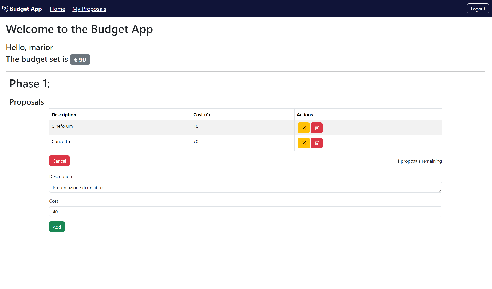
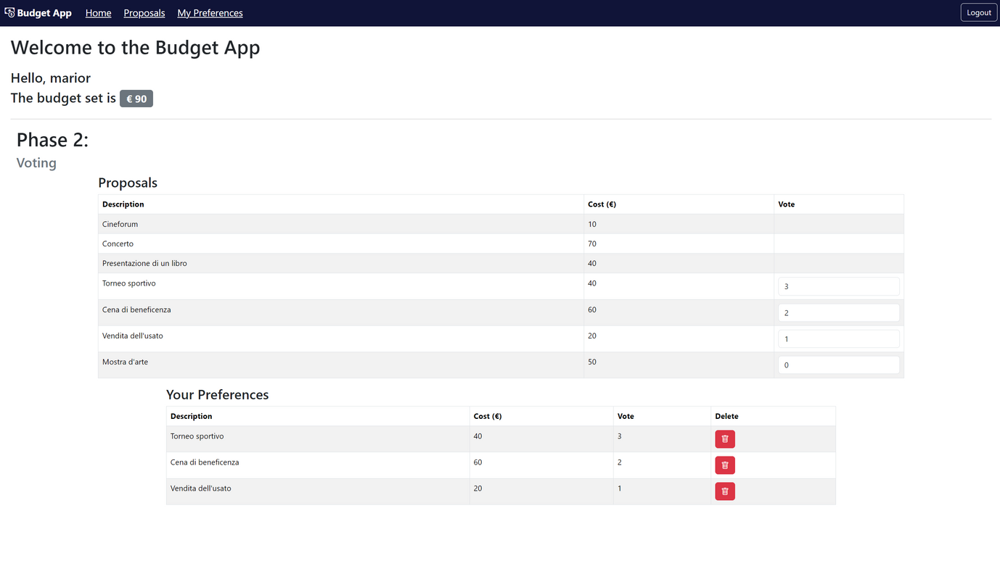

# Project for "Applicazioni Web I" course 

## Exam #2: "Budget Sociale"
## Student: s323914 POLIZZI SILVIA 

## React Client Application Routes

- Route `/`: if user is logged in, in this page is possible to see a table containing proposals of the user and a button that shows a form to add a new one, during phase 1; a table of all proposals and preferences of the logged user during phase 2; a table of accepted proposals and one for rejected proposals, during phase 3. If user is not logged in, the page shows the accepted proposals during phase 3. If admin is logged in, this page contains a button to the admin page.
- Route `/login`: page cointaining the login form.
- Route `/admin`: if admin is logged in, in this page is possible to set budget and change the phase.
- Route `/myproposals`: if user is logged in, in this page is possible to see the proposals of the user during phase 1.
- Route `/editProposal/:proposalId`: if user is logged in and proposalId exists, in this page is possible to edit a specific proposal during phase 1.
- Route `/proposals`: if user is logged in, in this page is possible to see the proposals of all users during phase 2.
- Route `/mypreferences`: if user is logged in, in this page user can set his preferences of proposals of phase 2.
- Route `/results`: this page contains approved proposals based on score and budget, during phase 3. If user is logged in, he can see also the rejected ones.

## API Server

- GET `/api/budget`: get the budget amount; use `isLoggedIn` middleware
  - no request body or parameters
  - return `200` with the budget amount
  - return `500` in case of server error

- POST `/api/budget`: set the budget amount; use `isLoggedInAsAdmin` and `checkPhase` middleware
  - request body contains the new budget amount
  - return `200` if the budget is set
  - return `401` if the user is not logged in as admin
  - return `403` if the phase is not 0
  - return `422` if the budget is not valid
  - return `500` in case of server error

- GET `/api/phases`: get the current phase; 
  - no request body or parameters
  - return `200` with the current phase
  - return `500` in case of server error

- POST `/api/phases`: set the current phase; use `isLoggedInAsAdmin` and `checkPhase` middleware
  - request body contains the new phase
  - return `200` if the phase is set
  - return `401` if the user is not logged in as admin
  - return `422` if the phase is not valid
  - return `500` in case of server error

- PUT `/api/phases`: update the current phase; use `isLoggedInAsAdmin` and `checkPhase` middleware
  - request body contains the new phase
  - return `200` if the phase is updated
  - return `401` if the user is not logged in as admin
  - return `422` if the phase is not valid
  - return `500` in case of server error

- GET `/api/proposals`: get user's proposals; use `isLoggedIn` and `checkPhase` middleware
  - no request body or parameters
  - return `200` with the proposals of the user
  - return `401` if the user is not logged in
  - return `403` if the phase is not 1
  - return `500` in case of server error

- POST `/api/proposals`: add a new proposal for current user; use `isLoggedIn` and `checkPhase` middleware
  - request body contains the description and cost of the proposal
  - return `201` if the proposal is added
  - return `401` if the user is not logged in
  - return `403` if the phase is not 1
  - return `422` if the proposal is not valid
  - return `500` in case of server error

- PUT `/api/proposals/:proposalId`: update a proposal of the current user; use `isLoggedIn` and `checkPhase` middleware
  - request body contains the new description and cost of the proposal and the proposalId as parameter
  - return `200` if the proposal is updated
  - return `401` if the user is not logged in
  - return `403` if the phase is not 1
  - return `404` if the proposal does not exist
  - return `422` if the proposal is not valid
  - return `500` in case of server error

- DELETE `/api/proposals/:proposalId`: delete a proposal of the current user; use `isLoggedIn` and `checkPhase` middleware
  - request contains the proposalId as parameter
  - return `200` if the proposal is deleted
  - return `401` if the user is not logged in
  - return `403` if the phase is not 1
  - return `404` if the proposal does not exist
  - return `500` in case of server error

- GET `/api/proposals/all`: get all proposals; use `isLoggedIn` and `checkPhase` middleware
  - no request body or parameters
  - return `200` with the proposals of all users
  - return `401` if the user is not logged in
  - return `403` if the phase is not 2
  - return `500` in case of server error

- GET `/api/preferences`: get user's preferences of proposals; use `isLoggedIn` and `checkPhase` middleware
  - no request body or parameters
  - return `200` with the preferences of the user
  - return `401` if the user is not logged in
  - return `403` if the phase is not 2
  - return `500` in case of server error

- POST `/api/preferences`: add a new preference for current user; use `isLoggedIn` and `checkPhase` middleware
  - request body contains the proposalId and score of the preference
  - return `201` if the preference is added
  - return `401` if the user is not logged in
  - return `403` if the phase is not 2
  - return `422` if the preference is not valid
  - return `500` in case of server error

- DELETE `/api/preferences/:proposalId`: delete a preference of the current user; use `isLoggedIn` and `checkPhase` middleware
  - request contains the proposalId as parameter
  - return `200` if the preference is deleted
  - return `401` if the user is not logged in
  - return `403` if the phase is not 2
  - return `404` if the preference does not exist
  - return `500` in case of server error

- GET `/api/proposals/approved`: get approved proposals; use  `checkPhase` middleware
  - no request body or parameters
  - return `200` with the approved proposals
  - return `403` if the phase is not 3
  - return `500` in case of server error

- GET `/api/proposals/notapproved`: get rejected proposals; use `isLoggedIn` and `checkPhase` middleware
  - no request body or parameters
  - return `200` with the rejected proposals
  - return `401` if the user is not logged in
  - return `403` if the phase is not 3
  - return `500` in case of server error

- DELETE `/api/proposals/:proposalId`: reset the database; use `isLoggedInAsAdmin` and `checkPhase` middleware
  - no request body or parameters
  - return `200` if the database is reset
  - return `401` if the user is not logged in as admin
  - return `403` if the phase is not 3
  - return `500` in case of server error

- POST `/api/sessions`: login;
  - request body contains the email and password
  - return `201` if the login is successful, with the user object in the body
  - return `401` if the user is not found or the password is wrong
  - return `500` in case of server error

- GET `/api/sessions/current`: get the current user;
  - no request body or parameters
  - return `200` with the user object
  - return `401` if the user is not logged in
  - return `500` in case of server error

- DELETE `/api/sessions/current`: logout;
  - no request body or parameters
  - return `200` if the logout is successful
  - return `401` if the user is not logged in
  - return `500` in case of server error

## Database Tables

- Table `users` - contains a row for each user, attributes are:
  - id TEXT (primary key)
  - role TEXT (admin or user)
  - email TEXT
  - password TEXT
  - salt TEXT

- Table `budget` - contains a unique row for the budget, attributes are:
  - id INTEGER (primary key)
  - amount INTEGER

- Table `phases` - contains a unique row for the current phase, attributes are:
  - id INTEGER (primary key)
  - phase INTEGER

- Table `preferences` - contains a row for each user's preferences, attributes are:
  - user_id TEXT (FOREIGN KEY(user_id) REFERENCES users(id)) 
  - proposal_id INTEGER (FOREIGN KEY(proposal_id) REFERENCES proposals(id))
  - score INTEGER
  - PRIMARY KEY(user_id, proposal_id)

- Table `proposals` - contains a row for each proposal, attributes are:
  - id INTEGER (primary key)
  - user_id TEXT (FOREIGN KEY(user_id) REFERENCES users(id))
  - description TEXT
  - cost INTEGER

## Main React Components

- `NavHeader` (in `NavHeader.jsx`): just the navigation bar, which may have links to home, login/logout, myproposals, proposals, mypreferences and results, based on phase and if user is logged in or not.
- `LoginForm` (in `AuthComponent.jsx`): contains the form for user login
- `AdminPage` (in `AdminPage.jsx`): contains the form to set budget and change phase, based on the current phase. Accessible only by admin.
- `HomePage` (in `HomePage.jsx`): contains the home page, with a welcome message and data about the current phase. If admin is logged in, it shows a button to the admin page.
- `PhaseOneLayout` (in `PhaseOne.jsx`): contains the table of proposals of the logged user and a button to show the form to add a new one. Accessible only by users.
- `ProposalForm` (in `ProposalForm.jsx`): contains the form to add or edit a proposal. Accessible only by users.
- `ProposalTable` (in `ProposalComponent.jsx`): contains the proposals depending on the phase. In first phase shows the proposals of the logged user, in second phase shows all proposals, in third phase shows the approved/rejected proposals. The attributes and actions of the table change based on the phase.
- `PhaseTwoLayout` (in `PhaseTwo.jsx`): contains the table of all proposals and preferences of the logged user.
- `UserPreferences` (in `PhaseTwo.jsx`): contains the table of user's preferences of proposals, with the possibility to revoke them. Accessible only by users.
- `PhaseThreeLayout` (in `PhaseThree.jsx`): contains the table of approved proposals and rejected ones (if logged in). 

## Screenshot

## Users Credentials

- adminapp@gmail.com, admin123
- silviapolizzi@gmail.com, silvia123
- user1@yahoo.it, user123
- mariorossi@libero.it, mario123
